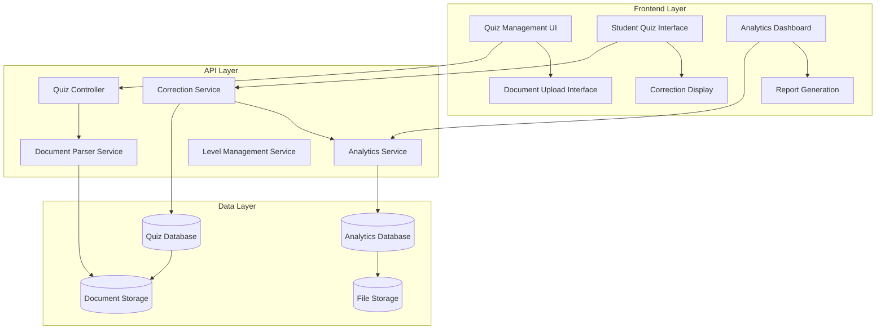

# Design Document

## Overview

The Enhanced Quiz System builds upon the existing quiz infrastructure to support document-based quiz imports, sophisticated correction mechanisms, proficiency level management, and comprehensive analytics. The system will maintain backward compatibility while adding powerful new features for both teachers and students.

## Architecture

### High-Level Architecture



### System Components

1. **Document Processing Engine**: Handles Word document parsing and content extraction
2. **Enhanced Quiz Engine**: Manages quiz execution with new question types and correction features
3. **Level Management System**: Handles proficiency level assignments and filtering
4. **Analytics Engine**: Processes performance data and generates insights
5. **Correction System**: Provides detailed feedback and explanations

## Components and Interfaces

### 1. Document Processing Service

**Purpose**: Parse Word documents and extract quiz content

**Key Methods**:
- `parseDocument(file: File): ParsedQuizData`
- `extractQuestions(content: string): Question[]`
- `identifyQuestionTypes(question: string): QuestionType`
- `validateDocumentStructure(content: string): ValidationResult`

**Data Structures**:
```typescript
interface ParsedQuizData {
  title: string;
  level: ProficiencyLevel;
  questions: ParsedQuestion[];
  metadata: DocumentMetadata;
}

interface ParsedQuestion {
  text: string;
  type: 'multiple_choice' | 'fill_blank' | 'short_answer' | 'essay';
  options?: string[];
  correctAnswer: string | string[];
  explanation?: string;
  points: number;
}
```

### 2. Enhanced Quiz Model

**Database Schema Extensions**:
```sql
-- Add to existing quiz table
ALTER TABLE quizzes ADD COLUMN proficiency_level ENUM('A1', 'A2', 'B1', 'B2', 'C1', 'C2');
ALTER TABLE quizzes ADD COLUMN correction_mode ENUM('immediate', 'end_of_quiz', 'manual');
ALTER TABLE quizzes ADD COLUMN source_document_path VARCHAR(255);

-- New table for detailed corrections
CREATE TABLE quiz_corrections (
    id UUID PRIMARY KEY,
    submission_id UUID REFERENCES quiz_submissions(id),
    question_id UUID REFERENCES quiz_questions(id),
    correction_text TEXT,
    explanation TEXT,
    improvement_suggestions TEXT,
    created_at TIMESTAMP,
    updated_at TIMESTAMP
);
```

### 3. Question Type Handlers

**Multiple Choice Handler**:
```typescript
class MultipleChoiceHandler implements QuestionHandler {
  evaluate(answer: string, correctAnswer: string): EvaluationResult;
  generateCorrection(answer: string, correctAnswer: string): CorrectionData;
}
```

**Fill-in-the-Blank Handler**:
```typescript
class FillBlankHandler implements QuestionHandler {
  evaluate(answer: string, acceptableAnswers: string[]): EvaluationResult;
  generateCorrection(answer: string, correctAnswers: string[]): CorrectionData;
}
```

### 4. Analytics Service

**Key Metrics**:
- Individual student performance trends
- Class-wide performance statistics
- Question difficulty analysis
- Time-based performance tracking
- Level-specific analytics

**API Endpoints**:
```typescript
interface AnalyticsAPI {
  getStudentPerformance(studentId: string, timeRange?: DateRange): StudentAnalytics;
  getClassAnalytics(classId: string, quizId?: string): ClassAnalytics;
  getQuestionAnalytics(questionId: string): QuestionAnalytics;
  generateReport(params: ReportParams): ReportData;
}
```

## Data Models

### Enhanced Quiz Model
```typescript
interface Quiz {
  id: string;
  title: string;
  description?: string;
  proficiencyLevel: 'A1' | 'A2' | 'B1' | 'B2' | 'C1' | 'C2';
  correctionMode: 'immediate' | 'end_of_quiz' | 'manual';
  sourceDocumentPath?: string;
  // ... existing fields
}
```

### Question Model Extensions
```typescript
interface Question {
  id: string;
  type: 'multiple_choice' | 'true_false' | 'fill_blank' | 'short_answer' | 'essay';
  text: string;
  explanation?: string;
  acceptableAnswers?: string[]; // For fill-in-the-blank
  gradingCriteria?: string; // For essay questions
  // ... existing fields
}
```

### Correction Model
```typescript
interface Correction {
  id: string;
  submissionId: string;
  questionId: string;
  studentAnswer: string;
  correctAnswer: string;
  isCorrect: boolean;
  correctionText: string;
  explanation: string;
  improvementSuggestions: string[];
  pointsEarned: number;
  maxPoints: number;
}
```

### Analytics Models
```typescript
interface StudentAnalytics {
  studentId: string;
  overallPerformance: PerformanceMetrics;
  levelProgress: LevelProgress[];
  weakAreas: string[];
  improvementTrends: TrendData[];
}

interface ClassAnalytics {
  classId: string;
  averageScore: number;
  completionRate: number;
  mostMissedQuestions: QuestionDifficulty[];
  timeSpentDistribution: TimeDistribution;
}
```

## Error Handling

### Document Processing Errors
- **Invalid Format**: Return structured error with supported formats
- **Parsing Failure**: Provide specific line/section where parsing failed
- **Content Validation**: List missing required elements

### Quiz Execution Errors
- **Time Limit Exceeded**: Auto-submit with partial answers
- **Connection Issues**: Save progress locally and sync when reconnected
- **Invalid Answers**: Validate on client and server side

### Analytics Errors
- **Insufficient Data**: Provide meaningful messages about minimum data requirements
- **Report Generation**: Handle large datasets with pagination and streaming

## Testing Strategy

### Unit Testing
- Document parser with various Word document formats
- Question type handlers with edge cases
- Analytics calculations with different data scenarios
- Correction generation algorithms

### Integration Testing
- End-to-end quiz taking flow with corrections
- Document upload and processing pipeline
- Analytics data aggregation and reporting
- Level-based quiz filtering and access control

### Performance Testing
- Large document processing (100+ questions)
- Concurrent quiz submissions
- Analytics query performance with large datasets
- Real-time correction generation

### User Acceptance Testing
- Teacher workflow: document upload to quiz creation
- Student workflow: quiz taking with immediate corrections
- Analytics dashboard usability
- Mobile responsiveness for quiz taking

## Security Considerations

### Document Upload Security
- File type validation and sanitization
- Virus scanning for uploaded documents
- Size limits and rate limiting
- Secure file storage with access controls

### Data Privacy
- Student performance data encryption
- GDPR compliance for analytics data
- Secure deletion of quiz attempts
- Access logging for sensitive operations

### API Security
- Role-based access control for analytics
- Rate limiting for document processing
- Input validation for all quiz data
- Secure session management during quiz taking

## Performance Optimization

### Document Processing
- Asynchronous processing for large documents
- Caching of parsed content
- Background processing queue
- Progress indicators for long operations

### Quiz Execution
- Client-side answer validation
- Optimistic UI updates
- Efficient question loading (pagination)
- Auto-save functionality

### Analytics
- Pre-computed aggregations
- Efficient database indexing
- Caching of frequently accessed reports
- Streaming for large datasets